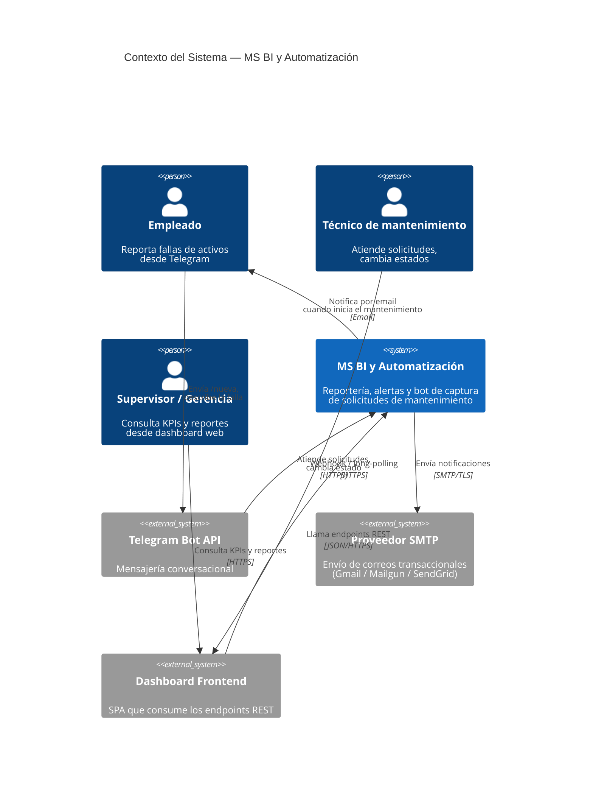
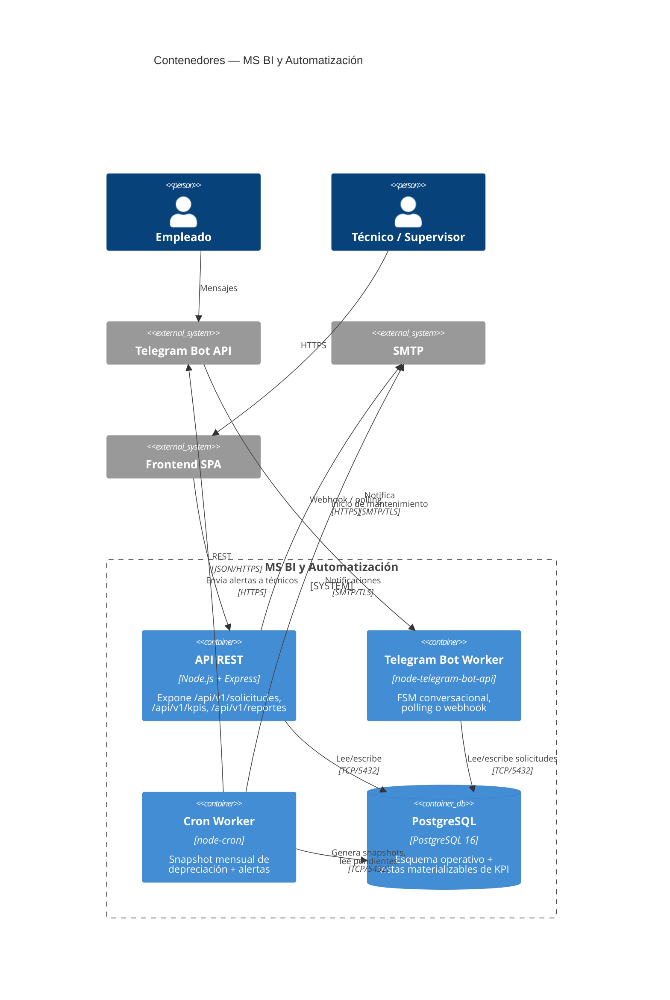
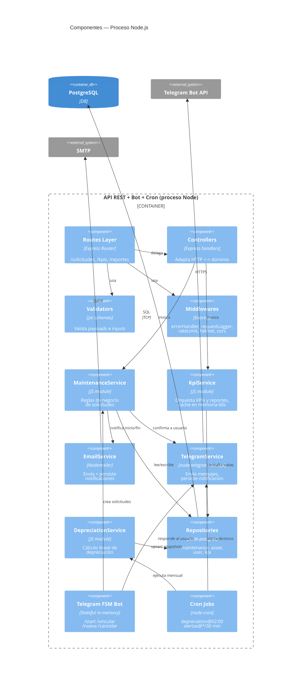
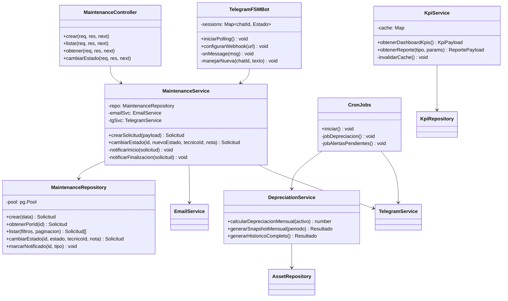
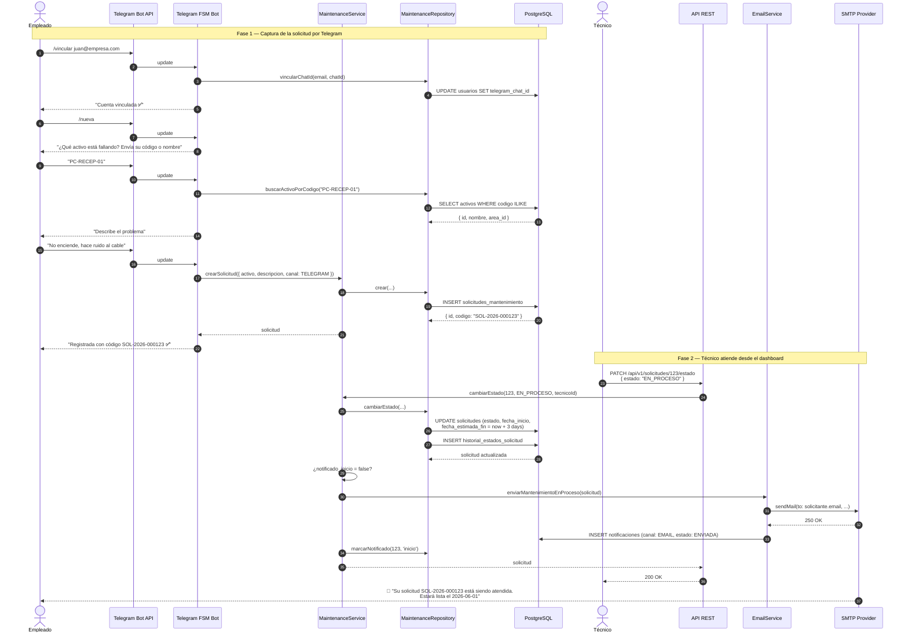
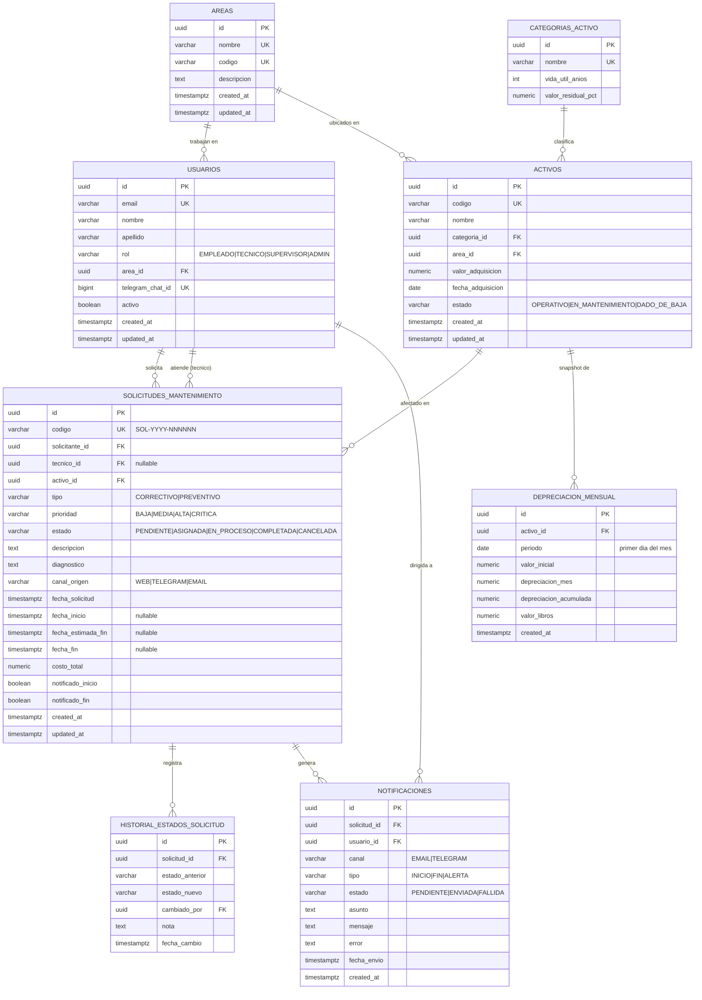

# Arquitectura — MS BI y Automatización

> Documento de arquitectura del microservicio. Incluye los 4 niveles del modelo **C4**, un diagrama de **secuencia** del flujo principal y el **diagrama entidad–relación** de la base de datos.
>
> Todos los diagramas están en sintaxis **Mermaid** y se renderizan directamente en GitHub, GitLab, Notion, VS Code (con la extensión *Markdown Preview Mermaid Support*) o en [mermaid.live](https://mermaid.live).

---

## 1. Visión general

El microservicio centraliza tres responsabilidades:

1. **BI / Reportería** — expone KPIs y reportes parametrizados sobre el ciclo de vida del activo fijo y la operación de mantenimiento.
2. **Automatización** — bot de Telegram que actúa como canal de captura de solicitudes (FSM conversacional) y notificaciones por correo cuando cambia el estado de la solicitud.
3. **Procesamiento batch** — jobs programados (cron) que generan snapshots mensuales de depreciación lineal y disparan alertas para solicitudes pendientes con prioridad alta.

Stack: **Node.js 20 + Express + PostgreSQL 16**. Despliegue objetivo: **Render** (free tier) con `PostgreSQL` administrado. Local: **Docker Compose**.

---

## 2. C4 — Nivel 1: Diagrama de Contexto

Muestra el sistema desde fuera: quién lo usa y con qué sistemas externos habla.



**Lectura:** el empleado nunca toca el dashboard; su único punto de contacto es Telegram. El dashboard es para técnicos y supervisores. El microservicio orquesta todo.

---

## 3. C4 — Nivel 2: Diagrama de Contenedores

Muestra los procesos desplegables del sistema y su comunicación.



**Notas de despliegue:**

- En **Render free** los tres contenedores (`api`, `bot`, `cron`) se empaquetan en **un solo proceso Node** (`server.js`) por límites del plan. La separación lógica se mantiene en código (`src/bots/`, `src/jobs/`, `src/app.js`) para que sea trivial extraerlos a procesos independientes cuando el volumen lo justifique.
- En producción el bot usa **webhook**; en local, **polling**.

---

## 4. C4 — Nivel 3: Diagrama de Componentes

Zoom dentro del proceso Node. Muestra la separación por capas.



**Convenciones:**

- **Routes** no contiene lógica de negocio.
- **Services** no conocen Express (`req/res`).
- **Repositories** son la única capa que ejecuta SQL.
- **Validators** desacoplan la validación del controlador.

---

## 5. C4 — Nivel 4: Diagrama de Código (clases / módulos clave)

Vista detallada de los módulos núcleo. Como JavaScript no tiene clases formales en todas las capas, se modelan las firmas reales.



---

## 6. Diagrama de secuencia — Flujo principal (CU-10)

Desde que el empleado abre Telegram hasta que recibe el correo de "su solicitud está siendo atendida".



**Puntos clave:**

- El campo `fecha_estimada_fin` se calcula automáticamente como `now() + 3 días` cuando el estado pasa a `EN_PROCESO`.
- La bandera `notificado_inicio` garantiza **idempotencia**: si el técnico re-guarda la solicitud, el correo no se duplica.
- La notificación se persiste en `notificaciones` para trazabilidad y reintentos.

---

## 7. Diagrama Entidad–Relación (ER)

Modelo de datos completo. Las **vistas** materializables de KPI se documentan en `KPIS_AND_REPORTS.md`.



### Restricciones e índices relevantes

| Constraint | Tabla | Detalle |
|---|---|---|
| `UNIQUE(activo_id, periodo)` | `depreciacion_mensual` | Garantiza un solo snapshot por activo por mes; permite UPSERT idempotente. |
| `CHECK (estado IN ...)` | `solicitudes_mantenimiento` | Estados válidos a nivel BD. |
| `IDX(estado, fecha_solicitud)` | `solicitudes_mantenimiento` | Soporta el job de alertas (pendientes > 4h). |
| `IDX(tecnico_id, estado)` | `solicitudes_mantenimiento` | Soporta dashboard del técnico. |
| `IDX(activo_id, periodo DESC)` | `depreciacion_mensual` | Consulta de valor libros vigente. |
| `IDX(telegram_chat_id)` | `usuarios` | Resolución rápida en cada update del bot. |

---

## 8. Decisiones de arquitectura (ADR resumidos)

| # | Decisión | Razón | Alternativa descartada |
|---|---|---|---|
| 1 | Monorepo con un solo proceso Node | Render free permite un único worker; separación lógica preservada en carpetas | Microservicios independientes (mayor costo) |
| 2 | Polling de Telegram en dev / webhook en prod | Dev necesita NAT-friendly; prod necesita eficiencia | Solo webhook (rompe en local) |
| 3 | KPIs como **vistas** SQL | El optimizador de Postgres cachea planes, código de servicio queda limpio | Cómputo en JS (más lento, duplica lógica) |
| 4 | FSM del bot en memoria | Volumen esperado bajo (< 100 sesiones concurrentes) | Redis (overkill en free tier) |
| 5 | Depreciación lineal precomputada (snapshot mensual) | Reportes históricos rápidos, auditables | Cálculo on-the-fly (más lento, sin trazabilidad) |
| 6 | Idempotencia por flags `notificado_inicio` / `notificado_fin` | Evita correos duplicados ante reintentos | Tabla de outbox (más complejo para el alcance actual) |
| 7 | Validación con **Joi** en routes | Cliente recibe errores claros antes de tocar capa de negocio | Validación dentro del servicio (acopla) |

---

## 9. Operabilidad

- **Healthcheck:** `GET /health` → verifica conexión a PostgreSQL.
- **Logs:** `pino` con `pino-pretty` en desarrollo y JSON estructurado en producción.
- **Métricas operativas mínimas:** se exponen como KPIs (ver `KPIS_AND_REPORTS.md`).
- **Apagado controlado:** `server.js` captura `SIGTERM` / `SIGINT`, detiene cron, drena el pool de PG, cierra el bot.

---

## 10. Cómo navegar los diagramas

- Para edición y exportación a PNG/SVG, copiar el bloque ` ```mermaid ... ``` ` a [mermaid.live](https://mermaid.live).
- En VS Code: instalar **Markdown Preview Mermaid Support** y abrir el preview con `Ctrl+Shift+V`.
- En GitHub/GitLab: se renderizan inline al hacer push del archivo.
